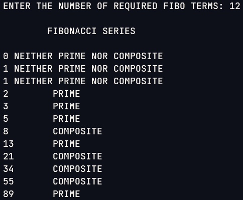

Question:

### Write C++ program using a user defined function to generate the Fibonacci series till n terms and print if each term is Prime or Composite.

<hr>

### Solution

```cpp
#include <iostream>
#include <stdlib.h>
using namespace std;
void Primechk(int a)
{
    int j;
    if (a == 0 || a == 1)
    {
        cout << " NEITHER PRIME NOR COMPOSITE";
    }
    else
    {
        for (j = 2; j < a; j++)
        {
            if (a % j == 0)
            {
                cout << "\t COMPOSITE";
                break;
            }
        }
        if (a == j)
            cout << "\t PRIME";
    }
}
void fibo(int n)
{
    int a = -1, b = 1, c = 0;
    for (int i = 1; i <= n; i++)
    {
        cout << endl;
        c = a + b;
        cout << c;
        Primechk(c);
        a = b;
        b = c;
    }
}
int main()
{
    int n;
    cout << "ENTER THE NUMBER OF REQUIRED FIBO TERMS: ";
    cin >> n;
    cout << "\n\tFIBONACCI SERIES\n";
    fibo(n);
    return 0;
}

```

<hr>

### Output

</img>
