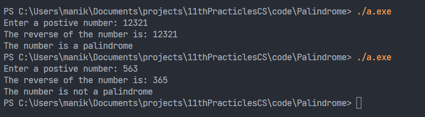

Question:

### Write a C++ program to enter any number and check whether the number is palindrome or not using while loop.

<hr>

### Solution

```cpp
#include <iostream>
using namespace std;
int main()
{
    int n, num, digit, rev = 0;

    cout << "Enter a postive number: ";
    cin >> num;
    n = num;

    while (num)
    {
        digit = num % 10;
        rev = (rev * 10) + digit;
        num = num / 10;
    }

    cout << "The reverse of the number is: " << rev << endl;

    if (n == rev)
    {
        cout << "The number is a palindrome";
    }
    else
    {
        cout << "The number is not a palindrome";
    }

    return 0;
}

```

<hr>

### Output

</img>
