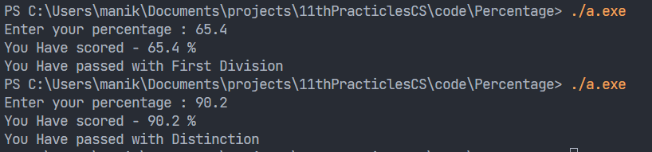

Question:

### Write a C++ program to input basic salary of an employee and Calculate it's Gross salary according to following

<table>
<tr>
<th>Percentage</th>
<th>Division</th>
</tr>

<tr>
<td> >= 80</td>
<td>Distinction</td>
</tr>

<tr>
<td> >= 60 and < 80 </td>
<td>First Division</td>
</tr>

<tr>
<td> >= 50 and < 60 </td>
<td>Second Division</td>
</tr>

<tr>
<td> >= 40 and < 50 </td>
<td>Third Division</td>
</tr>

<tr>
<td> < 40 </td>
<td>Fail</td>
</tr>
</tr>

</table>

### Solution

```cpp
#include <iostream>
using namespace std;
int main()
{
    float percent;
    int x;

    cout << "Enter your percentage : ";
    cin >> percent;
    cout << "You Have scored" << percent << " %" << endl;

    x = percent / 10;
    switch (x)
    {
    case 10:
    case 9:
    case 8:
        cout << "You Have passed with Distinction";
        break;
    case 7:
    case 6:
        cout << "You Have passed with First Division";
        break;
    case 5:
        cout << "You Have passed with Second Division";
        break;
    case 4:
        cout << "You Have passed with Third Division";
        break;
    default:
        cout << " Sorry But you have failed ";
        break;
    }
}
```

### Output

</img>
